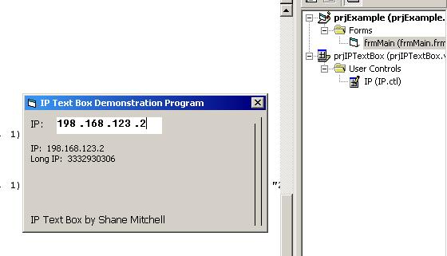



## IP Text Box

### Description

The IP Text Box lets you enter an IP into it. It has special features like you can only enter 3 digits in each segment, the number cannot be more than 255 in each segment (no matter how hard you try), it looks preddy, and it returns the IP and long IP. There is nothing else you would need!
 
### More Info
 
If you want to change the look of the textbox, like the color or anything, then just go into the control and change it :). Don't know why you would need to though. ;)

             |
---                |---
**Submitted On**   |2002-08-12 18:27:32
**By**             |[Shane S Mitchell](https://github.com/Planet-Source-Code/PSCIndex/blob/master/ByAuthor/shane-s-mitchell.md)
**Level**          |Advanced
**User Rating**    |5.0 (10 globes from 2 users)
**Compatibility**  |VB 5\.0, VB 6\.0
**Category**       |[OLE/ COM/ DCOM/ Active\-X](https://github.com/Planet-Source-Code/PSCIndex/blob/master/ByCategory/ole-com-dcom-active-x__1-29.md)
**World**          |[Visual Basic](https://github.com/Planet-Source-Code/PSCIndex/blob/master/ByWorld/visual-basic.md)
**Archive File**   |[IP\_Text\_Bo1170998122002\.zip](https://github.com/Planet-Source-Code/shane-s-mitchell-ip-text-box__1-37864/archive/master.zip)

